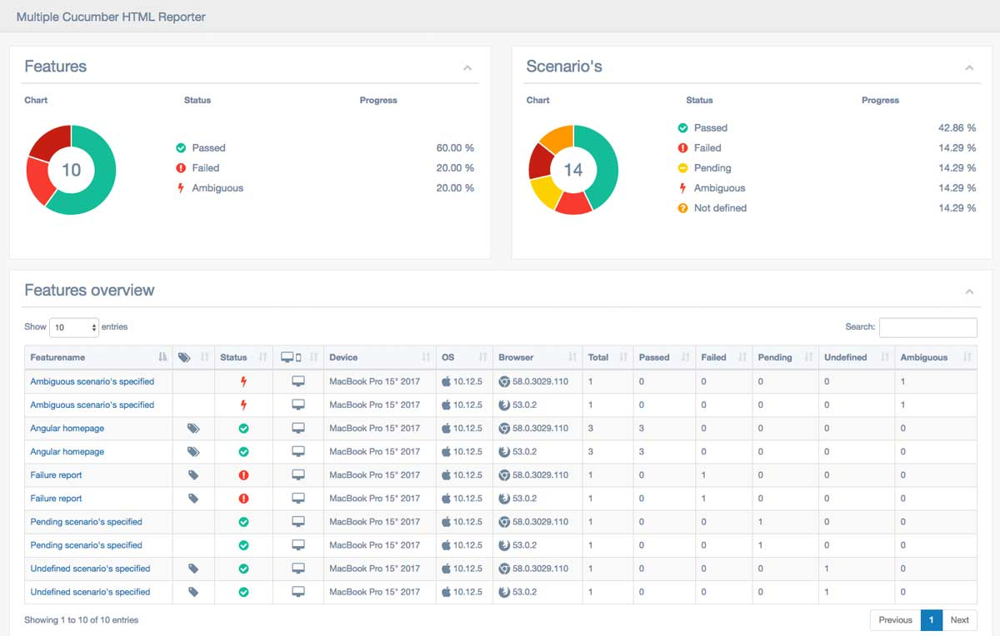

<!-- # IMPORTANT
**This project is in development** -->

# protractor-cucumber-typescript-boilerplate

A boilerplate for starting a Protractor test setup with CucumberJS and TypeScript

## What it can do
With this protractor-cucumber-typescript boilerplate you can easily start a testproject. With this boilerplate you get:

* feature and step-file examples about how to use
* no need to compile TypeScript testfiles before running
* automatically making screenshots on failed steps (you can adjust the filename to whatever you want, it's just a simple setup)
* generate latest test report using [protractor-multiple-cucumber-html-reporter-plugin](https://www.npmjs.com/package/protractor-multiple-cucumber-html-reporter-plugin)
* **NEW:** a configuration to automatically rerun flaky tests with [protractor-flake](https://github.com/NickTomlin/protractor-flake). This can be run with `npm run flake` and will check the logging for failed feature files before protractor exists

It supports and provides:

* [protractor](https://github.com/angular/protractor) version 5.1.2
* [cucumberjs](https://github.com/cucumber/cucumber-js/) **NEW version 3.x.x support!**
* [typescript](https://github.com/Microsoft/TypeScript) version 2.5.x
protractor-multiple-cucumber-html-reporter-plugin) version ^1.1.0
* [protractor-flake](https://github.com/NickTomlin/protractor-flake) version ^3.0.0



And a lot more, see the [`package.json`](package.json)

> This boilerplate is just to give you an initial setup, not how you should code / structure your projects. If you have some tips / beter examples feel free to create a Pull Request.

## How to use
### To see how this works

- do a `git clone` of this project
- go to the root of the project and execute `npm install`
- Skip the next 2 steps. If you already installed `webdriver-manager` and it's up and running.
- Install `webdriver-manager` globally on your machine. To install `webdriver-manager` please run `npm install -g webdriver-manager`.
- After successful installation of `webdriver-manager` do the following steps.
    `webdriver-manager update` (Setting up a Selenium Server)
    `webdriver-manager start` (Starting the Selenium Server)
    By default, the selenium server will run on http://localhost:4444/wd/hub.

- to get the tests running make sure you have a local `webdriver-manager` running. (`directConnect` from protractor has some issues, hope I will fix it soon).

### Then there are 3 ways to run tests:

1. Run 1 or multiple featurefiles. This can be done with `npm run e2e -- --feature=example` or `npm run e2e -- --feature= example,playground`. Only provide the name of the featurefile(s) without the `.feature`
2. Run a specific tagged test(s) / featurefile(s). This can be done with `npm run e2e -- --tags=@tagName`. Please check the [docs](https://docs.cucumber.io/tag-expressions/) about how to use tags
3. Run all the available featurefiles. This can be done with `npm run e2e`

> **If you want to run tests and  after failure only rerun the failed ones, then use `npm run flake` to run it with `protractor-flake`**

### To view the Test Report

- Install `lite-server`. To install `lite-server`, please run `npm install -g lite-server`.
- After succceful installation of `lite-server`. Goto your PROJECT_ROOT_DIRECTORY/.tmp/report (If you're in linux `cd PROJECT_ROOT_DIRECTORY/.tmp/report`)
- Then run `lite-server`.
- By default, lite-server uses port 3000. 
- That ist. Now you can goto http://localhost:3000/ to view the latest test reports

### Implement it in your project
Just copy this to your project. Copy all the `dev-dependencies` to your projects `package.json` and do a new `npm install` of your project.
You can use whatever taksrunner you want to run the tests.

## CucumberJS compiles on-the-fly
With the provided setup in the [`protractor.shared.conf.js`](/e2e-tests/config/protractor.shared.conf.js) you don't need to compile the TypeScript files before you run them. It will be done automatically for you with the `compiler` in the `cucumberOpts`.

```
cucumberOpts: {
	compiler: "ts:ts-node/register",
	require: [..],
	format: 'pretty',
	tags: ''
}
```


## When you don't have a `*.steps` file
When you created a `*.feature`-file you can start running the tests and it will throw an output like below.
See the [`example.steps.ts`](/e2e-tests/features/example.steps.ts) for the implementation.

> Advice is not to use the `callback`'s, just use `promises`.

    @example @happy-flow @angular
	Feature: Angular homepage

	  @example @happy-flow @angular @visitor @julie
	  Scenario: As a visitor I want to be greeted
	  ? Given I visit the Angular homepage
	  ? Given I submit the name "Julie"
	  ? Then I am greeted as "Hello Julie!"

	  @example @happy-flow @angular @todo @count @validate
	  Scenario: Validate todo list
	  ? Given I visit the Angular homepage
	  ? Given I count 2 todo's
	  ? Then the last todo should hold "build an AngularJS app"

	  @example @happy-flow @angular @todo @count @add
	  Scenario: Add a todo
	  ? Given I visit the Angular homepage
	  ? Given I add the todo "write a protractor test"
	  ? Then I should have 3 todo's
	  ? And the last todo should hold "write a protractor test"

	Warnings:

	1) Scenario: As a visitor I want to be greeted - e2e-tests/features/example.feature:8
	   Step: Given I visit the Angular homepage - e2e-tests/features/example.feature:5
	   Message:
	     Undefined. Implement with the following snippet:

	       Given('I visit the Angular homepage', function (callback) {
	         // Write code here that turns the phrase above into concrete actions
	         callback(null, 'pending');
	       });

	2) Scenario: As a visitor I want to be greeted - e2e-tests/features/example.feature:8
	   Step: Given I submit the name "Julie" - e2e-tests/features/example.feature:9
	   Message:
	     Undefined. Implement with the following snippet:

	       Given('I submit the name {stringInDoubleQuotes}', function (stringInDoubleQuotes, callback) {
	         // Write code here that turns the phrase above into concrete actions
	         callback(null, 'pending');
	       });

	3) Scenario: As a visitor I want to be greeted - e2e-tests/features/example.feature:8
	   Step: Then I am greeted as "Hello Julie!" - e2e-tests/features/example.feature:10
	   Message:
	     Undefined. Implement with the following snippet:

	       Then('I am greeted as {stringInDoubleQuotes}', function (stringInDoubleQuotes, callback) {
	         // Write code here that turns the phrase above into concrete actions
	         callback(null, 'pending');
	       });

	4) Scenario: Validate todo list - e2e-tests/features/example.feature:13
	   Step: Given I visit the Angular homepage - e2e-tests/features/example.feature:5
	   Message:
	     Undefined. Implement with the following snippet:

	       Given('I visit the Angular homepage', function (callback) {
	         // Write code here that turns the phrase above into concrete actions
	         callback(null, 'pending');
	       });

	5) Scenario: Validate todo list - e2e-tests/features/example.feature:13
	   Step: Given I count 2 todo's - e2e-tests/features/example.feature:14
	   Message:
	     Undefined. Implement with the following snippet:

	       Given('I count {int} todo\'s', function (int, callback) {
	         // Write code here that turns the phrase above into concrete actions
	         callback(null, 'pending');
	       });

	6) Scenario: Validate todo list - e2e-tests/features/example.feature:13
	   Step: Then the last todo should hold "build an AngularJS app" - e2e-tests/features/example.feature:15
	   Message:
	     Undefined. Implement with the following snippet:

	       Then('the last todo should hold {stringInDoubleQuotes}', function (stringInDoubleQuotes, callback) {
	         // Write code here that turns the phrase above into concrete actions
	         callback(null, 'pending');
	       });

	7) Scenario: Add a todo - e2e-tests/features/example.feature:18
	   Step: Given I visit the Angular homepage - e2e-tests/features/example.feature:5
	   Message:
	     Undefined. Implement with the following snippet:

	       Given('I visit the Angular homepage', function (callback) {
	         // Write code here that turns the phrase above into concrete actions
	         callback(null, 'pending');
	       });

	8) Scenario: Add a todo - e2e-tests/features/example.feature:18
	   Step: Given I add the todo "write a protractor test" - e2e-tests/features/example.feature:19
	   Message:
	     Undefined. Implement with the following snippet:

	       Given('I add the todo {stringInDoubleQuotes}', function (stringInDoubleQuotes, callback) {
	         // Write code here that turns the phrase above into concrete actions
	         callback(null, 'pending');
	       });

	9) Scenario: Add a todo - e2e-tests/features/example.feature:18
	   Step: Then I should have 3 todo's - e2e-tests/features/example.feature:20
	   Message:
	     Undefined. Implement with the following snippet:

	       Then('I should have {int} todo\'s', function (int, callback) {
	         // Write code here that turns the phrase above into concrete actions
	         callback(null, 'pending');
	       });

	10) Scenario: Add a todo - e2e-tests/features/example.feature:18
	    Step: And the last todo should hold "write a protractor test" - e2e-tests/features/example.feature:21
	    Message:
	      Undefined. Implement with the following snippet:

	        Then('the last todo should hold {stringInDoubleQuotes}', function (stringInDoubleQuotes, callback) {
	          // Write code here that turns the phrase above into concrete actions
	          callback(null, 'pending');
	        });

	3 scenarios (3 undefined)
	10 steps (10 undefined)
	0m00.002s
	[08:18:54] I/launcher - 0 instance(s) of WebDriver still running
	[08:18:54] I/launcher - chrome #01 passed


	==============================================================================================
	    Multiple Cucumber HTML report generated in:

	    PROJECT_ROOT_DIR/.tmp/report/index.html

	    Thanks for using Multiple Cucumber HTML report

	==============================================================================================

## When tests succeed
When tests succeed you will see the following

	@example @happy-flow @angular
	Feature: Angular homepage

	  @example @happy-flow @angular @visitor @julie
	  Scenario: As a visitor I want to be greeted
	  ✔ Given I visit the Angular homepage
	  ✔ Given I submit the name "Julie"
	  ✔ Then I am greeted as "Hello Julie!"

	  @example @happy-flow @angular @todo @count @validate
	  Scenario: Validate todo list
	  ✔ Given I visit the Angular homepage
	  ✔ Given I count 2 todo's
	  ✔ Then the last todo should hold "build an AngularJS app"

	  @example @happy-flow @angular @todo @count @add
	  Scenario: Add a todo
	  ✔ Given I visit the Angular homepage
	  ✔ Given I add the todo "write a protractor test"
	  ✔ Then I should have 3 todo's
	  ✔ And the last todo should hold "write a protractor test"

	3 scenarios (3 passed)
	10 steps (10 passed)
	0m09.857s
	[08:16:28] I/launcher - 0 instance(s) of WebDriver still running
	[08:16:28] I/launcher - chrome #01 passed


	==============================================================================================
	    Multiple Cucumber HTML report generated in:

	    PROJECT_ROOT_DIR/.tmp/report/index.html

	    Tnx for using Multiple Cucumber HTML report


	==============================================================================================


# Contribution
If you like to add some extra info, nice packages or have some improvements, feel free to add it and create Pull Request.


# Credits
This project is based on wswebcreation protractor-cucumber-typescript-boilerplate. I want to thank entire wswebcreation team for creating this awesome project setup.
